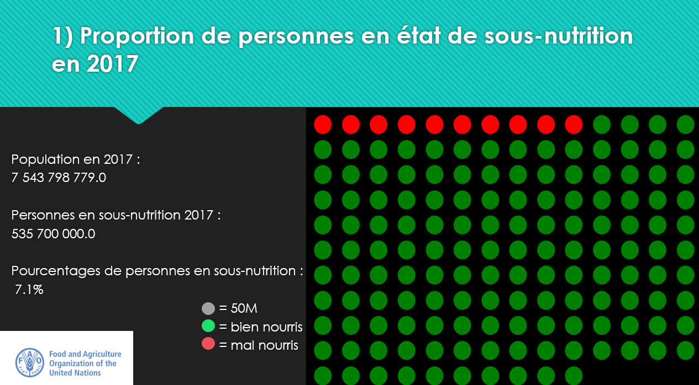
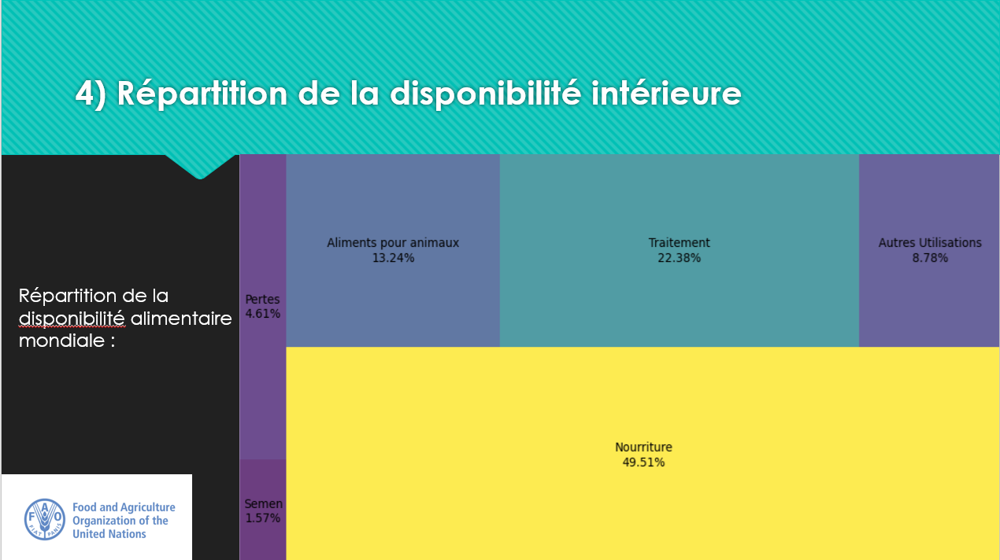
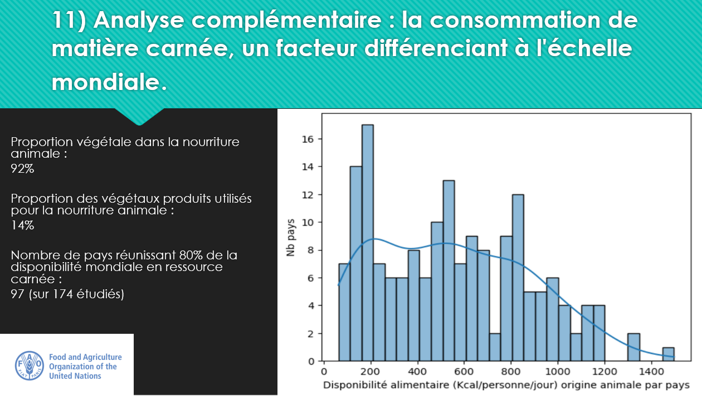

# Etude-sur-l-alimentation-dans-le-monde-

# Étude sur l'alimentation dans le monde

Python · Jupyter · Data visualisation · Formation

Y a-t-il des personnes en état de sous-nutrition dans le monde en 2017 ? Si oui, pourquoi ?

## Contexte

Ce projet a été réalisé dans le cadre de ma formation de Data Analyst chez OpenClassrooms. Il simule une mission pour la FAO (Organisation des Nations unies pour l'alimentation et l'agriculture) : analyser l'état de la sous-nutrition dans le monde en 2017 à partir de données publiques.

Les données proviennent de 5 fichiers : quatre de la FAO (population, disponibilité alimentaire, aide alimentaire, sous-nutrition) et un de l'EFSA (valeurs nutritionnelles de référence européennes), utilisé comme norme de comparaison.

## Démarche

1. **Exploration et nettoyage des données**
   - Inspection des 5 fichiers (dimensions, types, valeurs manquantes)
   - Harmonisation des unités (milliers d'habitants, milliers de tonnes, millions de personnes)
   - Traitement de la colonne de sous-nutrition, qui mélangeait chaînes de caractères et nombres (valeurs « <0,1 » converties en 0)
   - Les périodes triennales de la FAO sont traitées comme une moyenne centrée : la période 2016-2018 correspond à l'année 2017

2. **Analyses demandées**
   - Proportion de la population en sous-nutrition en 2017
   - Nombre théorique de personnes pouvant être nourries, avec l'ensemble des produits puis avec les seuls végétaux, sur la base du besoin énergétique moyen d'un adulte (2 386 kcal/jour, moyenne des références EFSA)
   - Répartition de la disponibilité intérieure (nourriture, alimentation animale, pertes, etc.)
   - Utilisation des céréales entre alimentation humaine et animale
   - Classements des pays : sous-nutrition, aide alimentaire reçue, disponibilité par habitant

3. **Analyses complémentaires menées de ma propre initiative** (voir la section dédiée)

4. **Restitution**
   - Visualisations Python (unit charts, treemaps, histogramme, graphiques empilés) et cartes dans la présentation finale

## Résultats

- **535,7 millions de personnes** sont en état de sous-nutrition en 2017, soit **7,1 %** de la population mondiale
- La disponibilité alimentaire mondiale aurait permis de nourrir **8,77 milliards d'adultes** (116 % de la population) et **7,24 milliards avec les seuls végétaux** (96 %)
- Seulement **49,5 %** de la disponibilité intérieure mondiale est destinée à la nourriture humaine, contre 13,2 % pour l'alimentation animale et 22,4 % pour le traitement industriel
- Les 10 pays les plus touchés (dont Haïti, la Corée du Nord et Madagascar, entre 29 % et 48 % de la population) ne sont pas ceux qui reçoivent le plus d'aide alimentaire (Syrie, Éthiopie, Yémen en tête)

## Aller plus loin : analyses complémentaires

Au-delà des questions de la mission, j'ai mené trois analyses pour comprendre les causes de la sous-nutrition :

- **Étude de cas sur le manioc en Thaïlande** : en 2017, 8,96 % de la population thaïlandaise est sous-alimentée, alors que les exportations de manioc représentent environ 400 % de la disponibilité intérieure. Réorienter ces exportations vers la consommation nationale ajouterait environ 160 kcal/jour/personne (+6 %). Or la disponibilité (2 785 kcal) dépasse déjà largement le besoin moyen : **le problème vient de l'accès et de la redistribution, pas du manque de calories**.
- **Inégalité de la disponibilité en produits carnés** : 97 pays sur 174 réunissent 80 % de la disponibilité mondiale d'origine animale, qui varie de 63 à près de 1 500 kcal/jour/personne selon les pays. Les végétaux représentent 92 % de l'alimentation des animaux d'élevage et mobilisent environ 14 % de la production végétale mondiale.
- **Détail de l'usage des céréales par variété** : 42,8 % des céréales servent à l'alimentation humaine et 36,3 % à l'alimentation animale, avec de fortes disparités. L'avoine et l'orge sont destinées majoritairement aux animaux, alors que le millet et le riz le sont aux humains.

## Réalisations

**Étude de cas : le manioc en Thaïlande (Python)**

```python
Thailand_Manioc = Thailand.loc[Thailand['Produit'] == 'Manioc']

# Part des exportations de manioc dans la disponibilité intérieure
pourcentage = (Thailand_Manioc['Exportations - Quantité']
               / Thailand_Manioc['Disponibilité intérieure'] * 100)
print(pourcentage.values)   # ≈ 402 %

# Hausse théorique si les exportations étaient consommées localement
hausse = Augmentation_kcal_j_p / Disponibilite_alimentaire_j_p_thailande * 100
print(hausse)               # ≈ 5,8 %
```


*Proportion de la population mondiale en sous-nutrition en 2017 (1 point = 50 M de personnes)*


*Répartition de la disponibilité intérieure mondiale*


*Disponibilité alimentaire d'origine animale par pays*

## Conclusion

- La production mondiale pourrait théoriquement nourrir toute la planète
- Seule la moitié de la disponibilité intérieure est dédiée directement à l'alimentation humaine
- L'aide alimentaire ne cible pas les pays où la sous-nutrition est la plus forte
- Pour certains pays, comme la Thaïlande, le problème est la redistribution plutôt que la disponibilité

## Stack

`Python` · `pandas` · `seaborn` · `matplotlib` · `squarify` · `Jupyter` · `Excel`

[Voir le projet complet sur GitHub →]()
[Retour à la liste de projets →]()
